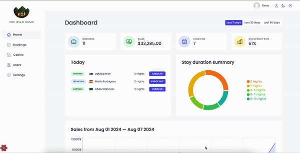

# The Wild Oasis

This is a React application built with Vite, React Query, Supabase, Styled Components, React Hook Form, advanced compound component pattern, charts, authentication and dark mode.

This application is intended as an admin application tool for the employees of The Wild Oasis hotel, where they can manage bookings, check the guests in and out, create accounts for other employees and view stats on various criteria like number of sales, bookings, stays, etc. on the admin dashboard.

## Dashboard page
